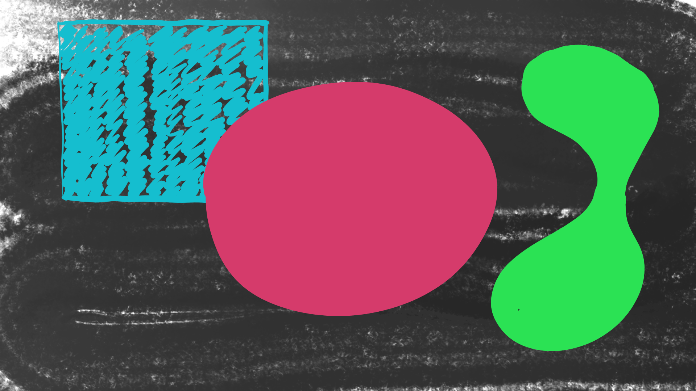

# abstract-art

This repository contains some random abstract art that I made as I progress my skills in art and graphic design. Here are a few of my digital art paintings although I'll update this given enough time.

# Paintings

The representation of one's self is always from their unique perspective.

In life, you always fail within hours of not appreciating what you already have.

# Artist

Matt, Copyright [Apps and Art](www.apps-and-art.org) 2025 &copy;
